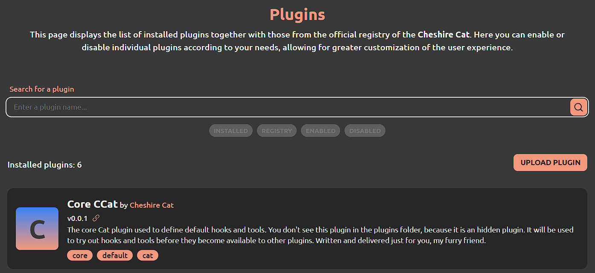

# Cat Code Commenter

This extension relies on a Cat plugin.
To install it:

1. Download the `.zip` folder.
2. Click on the `Upload plugin` button to install the "Plugin".
3. Start using the extension!

